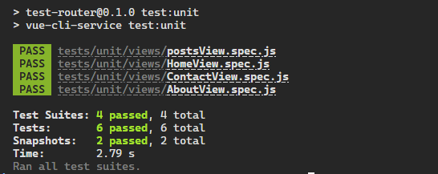

# Desafío - Pruebas Unitarias en un entorno Vue

💡 Realizado [cristiandpto23](https://github.com/cristiandpto23) con HTML y JS 
➡ Front-End G17 - Desafío Latam 

## Introducción

Validaremos nuestros conocimientos de Pruebas Unitarias en un entorno Vue.

## Descripción

Aplicando conceptos y herramientas aprendidas hasta ahora en la implementación de pruebas unitarias en una aplicación web con Vue JS, con un apoyo que consta de una aplicación sencilla, en la cual se implementan pruebas sobre una ruta definida como posts, en esta ocasión, debemos seguir escalando esta aplicación e incorporar nuevas rutas y además aplicar snapshots para validar la estructura HTML.

## Requerimientos

1. Dentro de la aplicación entregada como apoyo, define las rutas:

    - About.
    - Contact.

2. En el directorio de /tests/unit/views, incorpora los nuevos tests para las vistas antes mencionadas. Recuerda que al definir una nueva ruta se debe generar su componente.

3. Genera una prueba que permita crear un snapshot de la estructura HTML del componente HomeView.vue.

4. Genera una prueba que permita crear un snapshot de la estructura HTML del componente About.vue.

## Resultado final

## Tecnologías utilizadas

    
